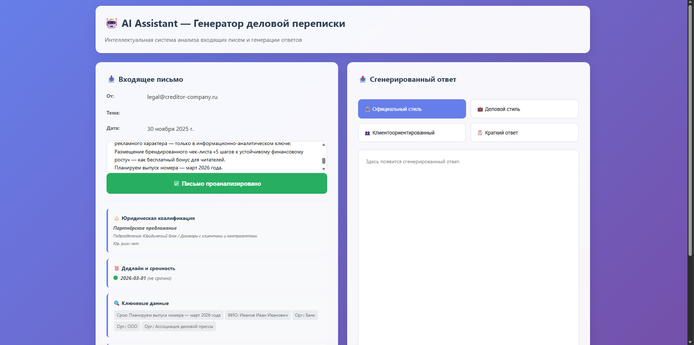
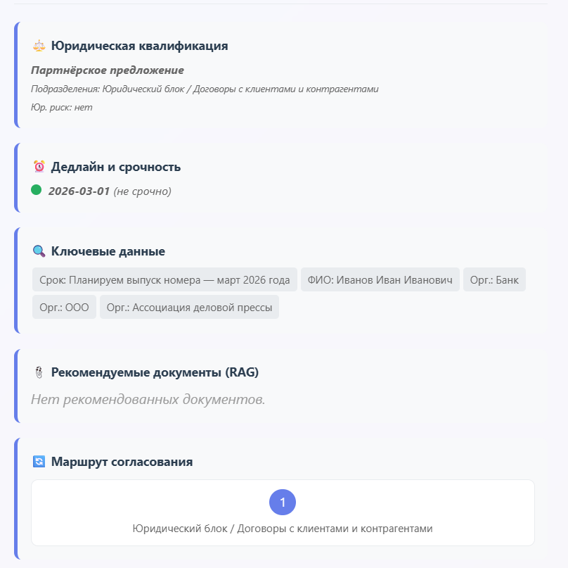
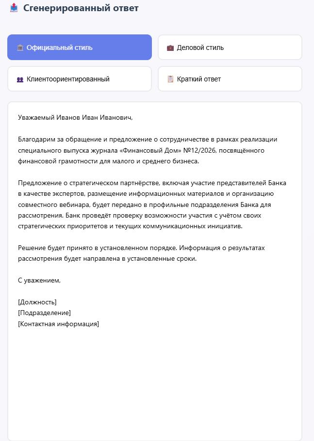
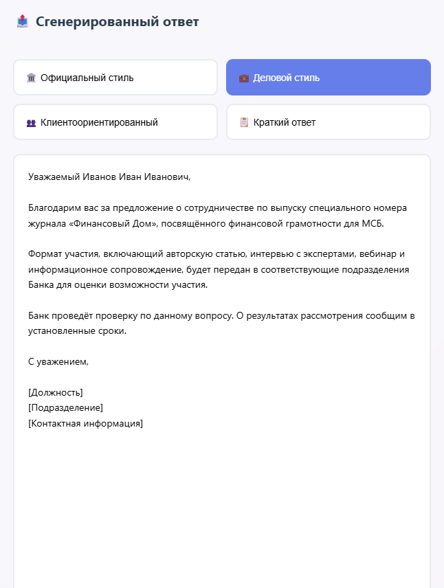
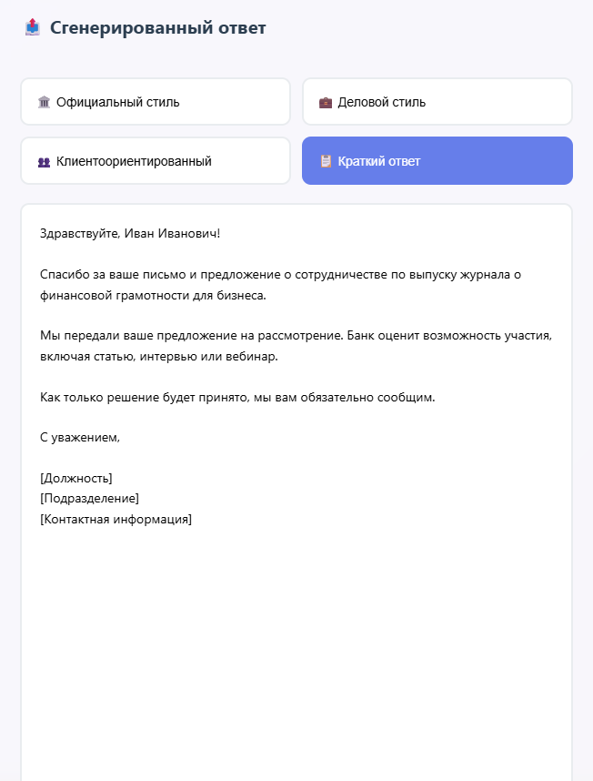

# AI Assistant — Генератор деловой переписки для банка

Инструмент для анализа входящих писем (клиенты, партнёры, регуляторы) и генерации ответов от лица банка с учётом:
- юридической квалификации письма,
- подразделений, вовлечённых в обработку,
- дедлайнов и срочности,
- извлечённых сущностей (договоры, даты, организации, контакты),
- комплаенс-проверки финального текста.

Проект состоит из Python-пайплайна (бекенд) и простого HTML-интерфейса (фронт), который подхватывает результаты из JSON.

---

## Скриншоты интерфейса

### Главный экран

Основной экран приложения: слева входящее письмо и результаты анализа, справа — сгенерированные ответы в разных стилях.



### Блок анализа письма

Юридическая квалификация, дедлайн и срочность, извлечённые ключевые данные и рекомендуемые документы (RAG), а также маршрут согласования по подразделениям.



### Сгенерированные ответы в разных стилях

**Официальный стиль:**



**Клиентоориентированный стиль:**


**Деловой стиль:**



**Краткий ответ:**



### Управляющие кнопки

Внизу — кнопки «Сгенерировать ответ» и «Отправить на согласование».


---

## Основные возможности

- 🧠 **NER-анализ** входящего письма  
  Извлечение:
  - номеров договоров,
  - сроков и дедлайнов,
  - ссылок на законы / указания ЦБ,
  - организаций,
  - контактных данных (e-mail, телефон, ФИО).

- **Классификация письма**
  - тип (жалоба, запрос информации, партнёрское предложение, регуляторный запрос и т.п.),
  - срочность,
  - формальность,
  - вовлечённые подразделения (юридический блок, финансы, договоры с клиентами и т.д.),
  - наличие / отсутствие юридического риска.

- **LLM1 — извлечение сути**
  - краткое описание сути запроса (`core_request`),
  - явные требования отправителя (`requirements`),
  - ожидания по результату (`expectations`).

- **LLM2 — генерация 4 вариантов ответа**
  - `official` — строгий официальный стиль,
  - `business` — деловой стиль,
  - `client_friendly` — более тёплый, клиентоориентированный,
  - `simple` — упрощённый, максимально понятный язык.  
  Все варианты — развёрнутые письма (несколько абзацев), а не одна-две строки.

- **LLM3 — юридическая и комплаенс-проверка**
  - смягчение жёстких формулировок и обещаний,
  - приведение формулировок к юридически безопасному виду,
  - сохранение смысла и объёма письма,
  - список замечаний по каждому варианту (`issues`).

- **UI (HTML + JS)**
  - отображение входящего письма,
  - блок с юридической квалификацией, дедлайнами, ключевыми данными и рекомендованными документами,
  - маршрут согласования по подразделениям,
  - переключение стилей ответа и просмотр сгенерированного письма,
  - кнопка «Отправить на согласование» (демо-логика на фронте).

---

## Архитектура пайплайна

Главная точка входа — `pipeline.py`.

Для одного письма выполняются шаги:

1. **Сохранение письма**
   - входная строка пишется в `letter.txt`.

2. **NER (`ner_yandex.py`)**
   - вызывает LLM через API,
   - пишет результат в `ner_output.json`, например:
     ```json
     {
       "contract_numbers": ["БС-1456"],
       "deadlines": [
         { "text": "в течение 3 рабочих дней", "date": null, "type": "relative" }
       ],
       "law_refs": ["Указание Банка России №55-У от 10.04.2024"],
       "contacts": {
         "emails": ["complaints@bank-prim.ru"],
         "phones": ["+7 (495) 123-45-67"],
         "persons": ["Иванов И.И."]
       },
       "organizations": ["ПАО «Банк Пример»"]
     }
     ```

3. **Классификация (`app_final_yandex.py`)**
   - тип письма, срочность, формальность,
   - целевые подразделения,
   - признак юридического риска,
   - результат в `classification_output.json`.

4. **LLM1 (`llm1_yandex.py`)**
   - извлекает:
     ```json
     {
       "core_request": "...",
       "requirements": "...",
       "expectations": "..."
     }
     ```
   - сохраняет в `llm1_output.json`.

5. **(опционально) RAG-скрипты**
   - `rag1_yandex.py` — подбор релевантных внутренних документов / регламентов и рекомендаций → `rag_docs_output.json`.
   - `rag2_yandex.py` — анализ, какие документы использованы в тексте ответов → `rag_usage_output.json`.  
   В базовой версии реализовано как «псевдо-RAG» через LLM, без реального векторного поиска.

6. **LLM2 (`llm2_yandex.py`)**
   - на вход получает:
     - `letter.txt`,
     - `ner_output.json`,
     - `classification_output.json`,
     - `llm1_output.json`,
     - при наличии — `rag_docs_output.json`.
   - генерирует 4 развёрнутых варианта ответа:
     ```json
     {
       "answers": {
         "official": "...",
         "business": "...",
         "client_friendly": "...",
         "simple": "..."
       }
     }
     ```
   - сохраняет в `llm2_output.json`.

7. **LLM3 (`llm3_yandex.py`)**
   - получает `llm2_output.json` (и при желании — информацию из RAG),
   - делает комплаенс-правки и выдаёт:
     ```json
     {
       "answers": {
         "official": "...",
         "business": "...",
         "client_friendly": "...",
         "simple": "..."
       },
       "issues": {
         "official": ["..."],
         "business": ["..."],
         "client_friendly": ["..."],
         "simple": ["..."]
       }
     }
     ```
   - пишет в `llm3_output.json`.

8. **Сбор данных для UI (`build_ui_payload.py`)**
   - агрегирует данные из:
     - `ner_output.json`,
     - `classification_output.json`,
     - `llm2_output.json` / `llm3_output.json`,
     - `rag_docs_output.json`
   - и формирует единый файл `ui_payload.json`, который подхватывает фронтенд.
